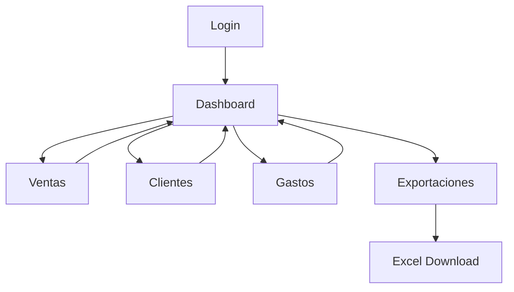

## 1. Product Overview
Migración de aplicación web de contabilidad empresarial desde HTML/JS vanilla a React + Tailwind CSS, manteniendo todas las funcionalidades existentes y conectividad con backend Python.

La aplicación permite a pequeños negocios gestionar ventas, gastos, clientes y obtener reportes financieros de manera simple y eficiente.

## 2. Core Features

### 2.1 User Roles
| Role | Registration Method | Core Permissions |
|------|---------------------|------------------|
| Free User | Email registration | Acceso limitado a 20 ventas/gastos mensuales |
| Pro User | Subscription upgrade | Acceso ilimitado a todas las funcionalidades |
| Business Owner | Business creation | Gestión completa de múltiples negocios |

### 2.2 Feature Module
Nuestra aplicación de contabilidad consiste en las siguientes páginas principales:
1. **Dashboard**: Resumen financiero, gráficos de ventas/gastos, clientes con deudas, proyecciones.
2. **Ventas**: Gestión de ventas, filtrado por fecha/cliente, creación/edición de ventas.
3. **Clientes**: Lista de clientes, gestión de deudas, filtrado y búsqueda.
4. **Gastos**: Registro de gastos, categorización, filtrado por fecha/tipo.
5. **Gastos Recurrentes**: Gestión de suscripciones y pagos periódicos (solo Pro).
6. **Metas de Ventas**: Establecimiento y seguimiento de objetivos de ventas.
7. **Exportaciones**: Generación de reportes en Excel de ventas y gastos.

### 2.3 Page Details
| Page Name | Module Name | Feature description |
|-----------|-------------|---------------------|
| Dashboard | Resumen General | Mostrar totales de ventas, gastos, balance y deudas con gráficos interactivos. |
| Dashboard | Selector de Período | Permitir cambiar entre vistas diaria, semanal, mensual y anual. |
| Dashboard | Ventas Recientes | Listar últimas 10 ventas con cliente, monto y fecha. |
| Dashboard | Clientes Deudores | Mostrar top 10 clientes con mayor deuda pendiente. |
| Dashboard | Proyecciones | Gráfico de tendencias de ventas y gastos últimos 30 días. |
| Ventas | Lista de Ventas | Tabla paginada con búsqueda, filtros por fecha y cliente. |
| Ventas | Nueva Venta | Formulario para crear venta con cliente, productos, monto y notas. |
| Ventas | Editar Venta | Modal para modificar ventas existentes y gestionar pagos. |
| Ventas | Eliminar Venta | Confirmación y eliminación de ventas con actualización de saldos. |
| Clientes | Lista de Clientes | Tabla con búsqueda, filtro por estado (activo/inactivo/deudor). |
| Clientes | Nuevo Cliente | Formulario para registrar cliente con nombre, email, teléfono y dirección. |
| Clientes | Editar Cliente | Modal para actualizar información del cliente. |
| Clientes | Gestión de Deudas | Ver historial de pagos y saldo pendiente. |
| Gastos | Lista de Gastos | Tabla con búsqueda y filtros por fecha y categoría. |
| Gastos | Nuevo Gasto | Formulario con categoría, monto, descripción y fecha. |
| Gastos | Editar Gasto | Modal para modificar gastos existentes. |
| Gastos | Categorías | Gestión de categorías de gastos personalizadas. |
| Gastos Recurrentes | Lista de Gastos | Tabla de gastos periódicos con estado y próxima fecha. |
| Gastos Recurrentes | Nuevo Gasto Recurrente | Formulario con frecuencia (mensual/semanal/diaria). |
| Metas de Ventas | Lista de Metas | Tabla con metas activas y archivadas. |
| Metas de Ventas | Nueva Meta | Formulario con monto objetivo, fecha límite y descripción. |
| Exportaciones | Exportar Ventas | Generar archivo Excel con ventas filtradas. |
| Exportaciones | Exportar Gastos | Generar archivo Excel con gastos filtrados. |

## 3. Core Process

### Flujo de Usuario Principal:
1. Usuario inicia sesión → Dashboard con resumen financiero
2. Desde Dashboard puede navegar a:
   - Ventas: Ver/crear ventas → Actualizar automáticamente dashboard
   - Clientes: Gestionar clientes → Ver deudas actualizadas
   - Gastos: Registrar gastos → Actualizar balance general
3. Todas las acciones actualizan en tiempo real los gráficos y resúmenes.

### Flujo de Exportación:
Usuario selecciona período → Aplica filtros → Genera Excel → Descarga archivo

## 4. User Interface Design

### 4.1 Design Style
- **Colores Primarios**: Gris oscuro (#1f2937) fondo, blanco para textos principales
- **Colores Secundarios**: Azul (#3b82f6) para acentos y botones principales
- **Estilo de Botones**: Rounded-lg con hover effects y transiciones suaves
- **Tipografía**: Inter font family, tamaños 14-18px para contenido, 24-32px para títulos
- **Layout**: Sidebar navigation fijo, contenido scrollable, cards con glassmorphism
- **Iconos**: Phosphor Icons para consistencia visual
- **Animaciones**: Transiciones de 200-300ms para interacciones

### 4.2 Page Design Overview
| Page Name | Module Name | UI Elements |
|-----------|-------------|-------------|
| Dashboard | Resumen Cards | Grid 2x2 en desktop, stack vertical en móvil con valores grandes y trend indicators. |
| Dashboard | Gráficos | Chart.js integrado con tooltips interactivos y colores coordinados. |
| Dashboard | Tablas | Striped rows, hover effects, sortable headers con iconos. |
| Ventas | Formularios | Input groups con labels arriba, validación en tiempo real, botones primarios destacados. |
| Clientes | Search Bar | Input ancho con icono de búsqueda, filtros como dropdowns compactos. |
| Gastos | Categorías | Tag-style badges con colores por categoría, editable inline. |

### 4.3 Responsiveness
- **Desktop-first**: Diseño optimizado para pantallas grandes (1280px+)
- **Mobile-adaptive**: Breakpoints en 768px y 480px
- **Touch optimization**: Botones mínimo 44px, espaciado amplio en móviles
- **Sidebar**: Se convierte en bottom navigation en móviles