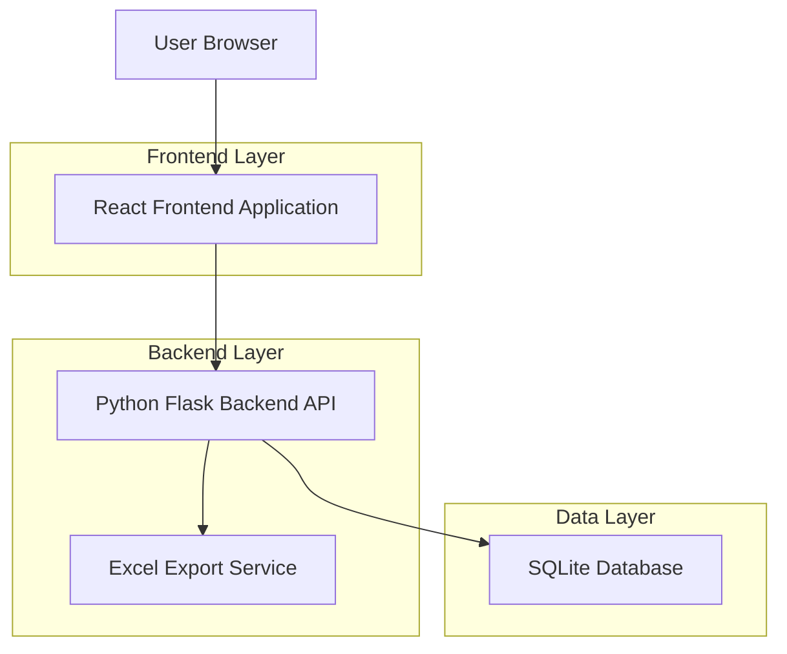
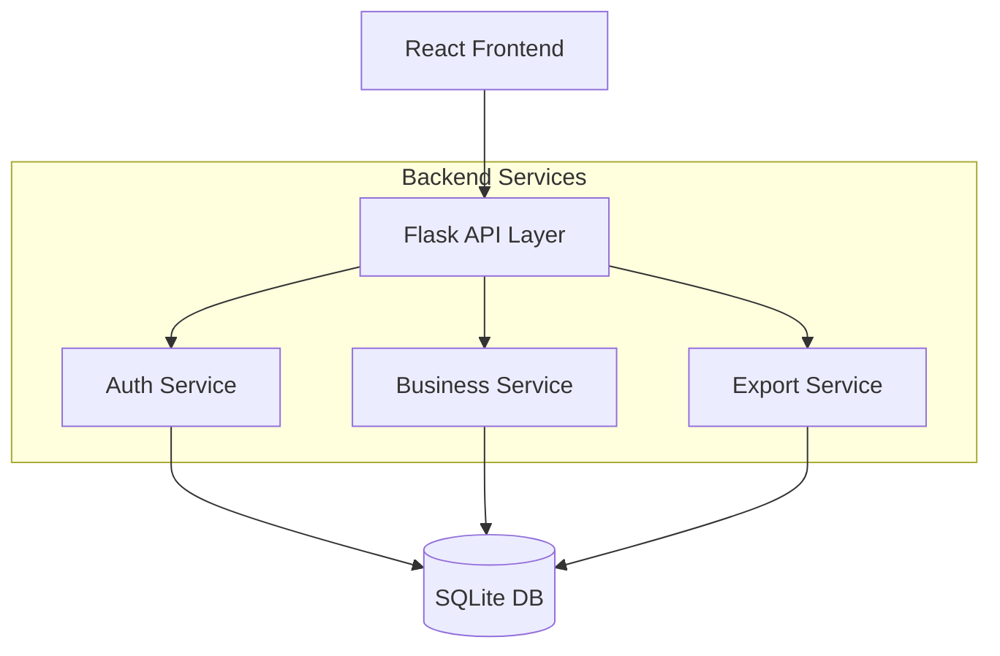
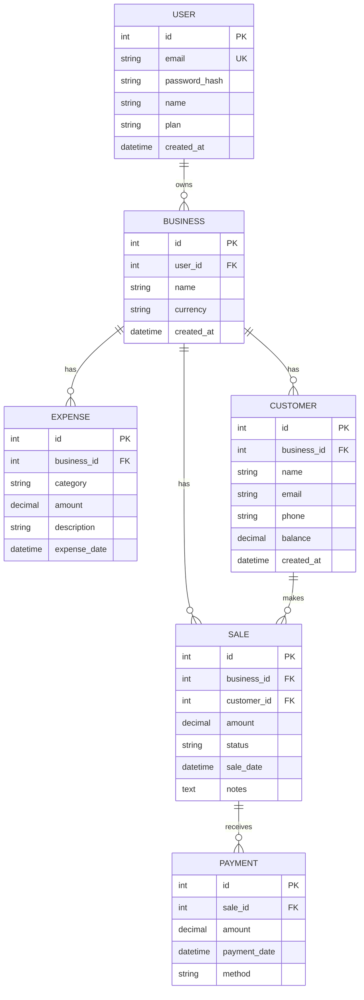

## 1. Architecture design



## 2. Technology Description

- **Frontend**: React@18 + Tailwind CSS@3 + Vite
- **Initialization Tool**: vite-init
- **Backend**: Python Flask (existente)
- **Database**: SQLite (existente)
- **HTTP Client**: Axios para llamadas API
- **State Management**: React Context + useReducer
- **Routing**: React Router DOM@6
- **Charts**: Chart.js + react-chartjs-2
- **Excel Export**: Mantener servicio Python existente

## 3. Route definitions

| Route | Purpose |
|-------|---------|
| / | Login page, autenticación de usuarios |
| /dashboard | Dashboard principal con resumen financiero |
| /sales | Gestión de ventas y transacciones |
| /customers | Administración de clientes y deudas |
| /expenses | Control de gastos y categorías |
| /recurring-expenses | Gestión de gastos periódicos (Pro) |
| /sales-goals | Establecimiento y seguimiento de metas |
| /reports | Exportación de reportes en Excel |

## 4. API definitions

### 4.1 Authentication APIs

```
POST /api/auth/login
```

Request:
| Param Name | Param Type | isRequired | Description |
|------------|------------|------------|-------------|
| email | string | true | Email del usuario |
| password | string | true | Contraseña del usuario |

Response:
| Param Name | Param Type | Description |
|------------|------------|-------------|
| token | string | JWT token para autenticación |
| user | object | Datos del usuario autenticado |

### 4.2 Business APIs

```
GET /api/businesses/{id}/dashboard
```

Response:
| Param Name | Param Type | Description |
|------------|------------|-------------|
| stats | object | Estadísticas generales del negocio |
| recent_sales | array | Ventas recientes |
| top_debtors | array | Clientes con mayor deuda |
| chart_data | object | Datos para gráficos |

### 4.3 Sales APIs

```
GET /api/businesses/{id}/sales
POST /api/businesses/{id}/sales
PUT /api/businesses/{id}/sales/{sale_id}
DELETE /api/businesses/{id}/sales/{sale_id}
```

### 4.4 Customers APIs

```
GET /api/businesses/{id}/customers
POST /api/businesses/{id}/customers
PUT /api/businesses/{id}/customers/{customer_id}
```

### 4.5 Expenses APIs

```
GET /api/businesses/{id}/expenses
POST /api/businesses/{id}/expenses
PUT /api/businesses/{id}/expenses/{expense_id}
```

### 4.6 Export APIs

```
GET /api/businesses/{id}/export/sales
GET /api/businesses/{id}/export/expenses
```

## 5. Server architecture diagram



## 6. Data model

### 6.1 Data model definition



### 6.2 Frontend State Management

```typescript
// Global App State
interface AppState {
  user: User | null;
  business: Business | null;
  token: string | null;
  dashboard: DashboardData | null;
  sales: Sale[];
  customers: Customer[];
  expenses: Expense[];
  loading: boolean;
  error: string | null;
}

// Component Props Types
interface DashboardProps {
  stats: BusinessStats;
  recentSales: Sale[];
  topDebtors: Customer[];
  chartData: ChartData;
}

interface SalesListProps {
  sales: Sale[];
  customers: Customer[];
  onSaleCreate: (sale: NewSale) => void;
  onSaleUpdate: (id: number, sale: UpdateSale) => void;
  onSaleDelete: (id: number) => void;
}
```

### 6.3 API Response Types

```typescript
// Common API Response
interface ApiResponse<T> {
  success: boolean;
  data: T;
  message?: string;
  error?: string;
}

// Dashboard Response
interface DashboardResponse {
  stats: {
    total_sales: number;
    total_expenses: number;
    balance: number;
    total_debt: number;
  };
  recent_sales: Sale[];
  top_debtors: Customer[];
  chart_data: {
    sales_by_day: ChartPoint[];
    expenses_by_category: ChartPoint[];
  };
}
```

## 7. Migration Strategy

### 7.1 Phase 1: Setup y Estructura Base
- Configurar proyecto React con Vite
- Implementar sistema de autenticación
- Crear layout principal y navegación

### 7.2 Phase 2: Dashboard y Resúmenes
- Migrar dashboard con gráficos
- Implementar llamadas API al backend existente
- Mantener misma lógica de cálculos

### 7.3 Phase 3: Módulos Principales
- Migrar páginas de Ventas, Clientes, Gastos
- Mantener mismos formularios y validaciones
- Preservar funcionalidad de exportación Excel

### 7.4 Phase 4: Funcionalidades Avanzadas
- Gastos recurrentes (solo Pro)
- Metas de ventas
- Sistema de notificaciones

### 7.5 Phase 5: Testing y Deployment
- Testing de todas las funcionalidades
- Verificar conectividad con backend Python
- Deployment con mismo servidor Flask